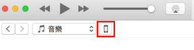

## How To Import Presets To Headset
There are 2 steps to import preset files into the headset.

1. Put the preset file to the iOS app.
2. Import the preset file from the iOS app into the headset.


##Put The Preset File To The iOS App
There are many ways to put the preset file to the iOS app. The easiest way would be using [iTunes Shared Folder](https://support.apple.com/en-us/HT201301). That's it, there will be a **Documents** folder for the app, and it is accessible for the app and the users. Please refer to [Apple's document](https://developer.apple.com/library/content/documentation/FileManagement/Conceptual/FileSystemProgrammingGuide/FileSystemOverview/FileSystemOverview.html) for more details about the **Documents** folder.

One of the many ways to put preset files to the **Documents** folder is via the iTunes application.

To put preset files into RelaxKitExample via iTunes, connect your iOS device to your desktop PC then execute iTunes. Tap the device icon in the top of the application.



Which brings up your device's information. Then choose **App**


Scroll down the window on the right, and select the app you want to put your files into.


You can then drag and drop your files into the right most window the put the files into the **Documents** folder of the app.


##Import The Preset Files Into The Headset
There are currently 4 presets available. 

1. Music( BONGIOVI\_DEFAULT\_PRESET_1 )
2. Movie( BONGIOVI\_DEFAULT\_PRESET_2 )
3. Game( BONGIOVI\_CUSTOM\_PRESET_1 )
4. Voice( BONGIOVI\_CUSTOM\_PRESET_2 )

Custom presets can be imported from iOS app to the headset

```
typedef enum : NSUInteger {
    BONGIOVI_DEFAULT_PRESET_1 = 0,      // pre-defined, can be exported only
    BONGIOVI_DEFAULT_PRESET_2,          // pre-defined, can be exported only
    BONGIOVI_CUSTOM_PRESET_1,           // user defined, can be imported and exported
    BONGIOVI_CUSTOM_PRESET_2,           // user defined, can be imported and exported
    BONGIOVI_CUSTOM_PRESET_3,           // user defined, can be imported and exported
    BONGIOVI_PRESETS_NUM,
} BONGIOVI_PRESET;
```
-
To import custom presets to the headset, use the following API
`-(BOOL) DPS_ImportPreset:(NSString*)presetFilePath toCustomPreset:(NSUInteger)customPresetIndex;`
